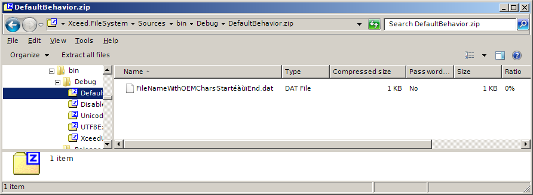
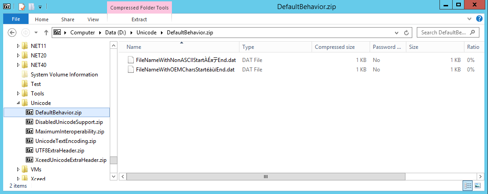
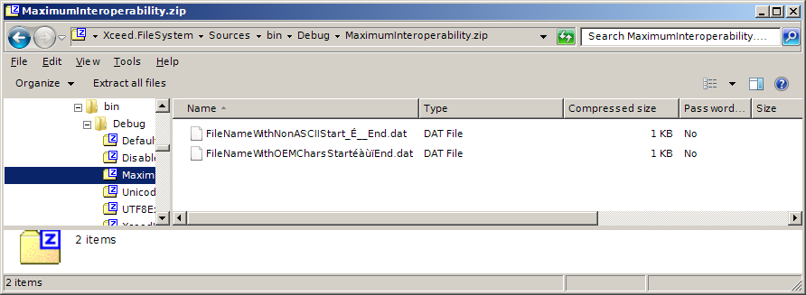
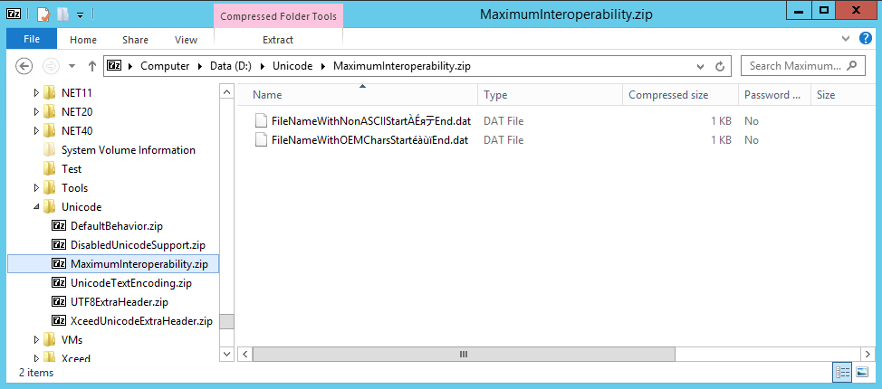
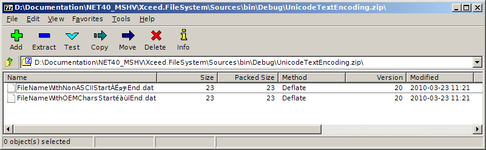

import Tabs from '@theme/Tabs';
import TabItem from '@theme/TabItem';

# Handling Unicode characters
The original Zip specification does not support non-ASCII, international characters. Thanks to extensions to the specification, [Unicode](https://en.wikipedia.org/wiki/Unicode), the widespread standard for the encoding, representation and handling of text expressed in most of the world's writing systems, is available to encode filenames and comments. Unicode support was added to the specification years after the original version. Because of this, Unicode support is not universal amongst zip tools. Some tools will not show or extract Unicode paths and files names correctly if at all.

All Xceed Zip components handle Unicode characters automatically by default, so this is not an issue if an application uses Xceed components to create, update and extract zip archives. Issues can arise when 3rd party zip tools with varying support for Unicode are used in some operations. This becomes an interoperability problem.

## Types of Unicode support for zip archives with Xceed Zip components

A zip archive contains, for each file, meta-data about the items in the archive: the name and path of file/folder, optional comment, dates, compression method, etc. It is in the text-based meta-data that Unicode can be applied.

:::note
The path and filename of the zip file itself is not covered by the zip specification's Unicode support. The name of the zip file is determined by your application and is governed by the rules of your operating system.
:::

A zip archive is made up of the items (files or folders) archived one after the other. Each item is made up of a header, followed with the item's compressed data. That header is made up of a standard set of fields followed by a sequence of optional extra headers. Meta-data is located in those headers. The most important field, with regards to Unicode is the filename field. That field is part of the standard set of fields for each item in an archive.

The Zip format has historically supported only the original IBM PC character encoding set, commonly referred to as [IBM Code Page 437](https://en.wikipedia.org/wiki/Code_page_437). This limits storing file name characters to only those within the original MS-DOS range of values and does not properly support file names in other character encodings, or languages. To solve this, several independent solutions exist:    

- Xceed implemented an optional extra header definition where the file path and comment is read and/or written as Unicode (UTF-16, little endian), ignoring the value in the standard header. This solution is controlled by the `ZipArchive.DefaultExtraHeaders` property with the Unicode value. The Xceed Unicode extra header is deprecated and should not be used in new code.
- Version 6.3.0 of the Zip specification added an option for Unicode (UTF-8) filename storage in the standard field, instead of using IBM character encoding. This solution is controlled by the `ZipArchive.DefaultTextEncoding` property with the Unicode value.
- Version 6.3.2 of the Zip specification added an optional extra header definition where the file path and/or comment is read and/or written as Unicode (UTF-8), ignoring the value in the standard header. This solution is controlled by the `ZipArchive.DefaultExtraHeaders` property with the UTF8Filename value.

Every flavor of Xceed Zip components support all these solutions. They can be activated (or not) independently of each other in any combination.

## Unicode interoperability

Not every 3rd party zip tool support the Unicode options mentioned above. Some tools don't support any of them, some support some of them. Often, Unicode support is not clearly advertised and if it is, it's not clearly explained what method is used.

Interoperability is the ability of making different systems work together. In the case of Zip and Unicode, it applies when zip archives are created with Xceed Zip for .NET and will be extracted by other zip tools. It also applies when zip archives created by other zip tools are extracted by Xceed Zip for .NET.

## Zip archives created by 3rd party zip tools extracted by Xceed Zip for .NET

Xceed Zip for .NET (and all zip components from Xceed) supports all Unicode options defined in the Zip specification and a proprietary solution. This means that it should be able to automatically properly handle Unicode characters in any archive created by a 3rd party zip tool unless it uses a proprietary solution.

## Zip archives created by Xceed Zip for .NET extracted by 3rd party zip tools

Because not every 3rd party zip tool supports Unicode options, interoperability problems are likely in this situation if filenames or comments contain non-ASCII characters. The symptoms will be that these filenames will contain incorrect characters when viewed or extracted by 3rd party tools that don't support Unicode.

Even if some Unicode options are enabled when you create archives with Xceed Zip for .NET, if a 3rd party zip tool doesn't support that specific option, filenames will appear incorrectly.

:::note
Remember that Unicode issues only affect the meta data of an item, not the file data itself.
:::

## Default behavior

To show the effects of interoperability problems, we will use an example where a zip archive is created to contain two files. The first file will be named "FileNameWithNonASCIIStartÀÉяテEnd.dat" and will have the comment "私のコメント". The second file's name will be, "FileNameWithOEMCharsStartéàùïEnd.dat" and will not have any comment.

<details>
  <summary>Code: Creating an archive using the default Unicode behavior</summary>
<Tabs>
  <TabItem value="csharp" label="C#" default>
    ```csharp
      public static void DefaultBehavior()
      {
        /* The path and filename of the zip file itself is not covered by the zip specification's
        * Unicode support. The name of the zip file is determined by your application and is
        * governed by the rules of your operating system. */
        AbstractFile zipFile = new DiskFile( "DefaultBehavior.zip" );

        // Delete any existing zip file
        if( zipFile.Exists )
          zipFile.Delete();

        // Create a logical zip archive around the zip file
        ZipArchive zip = new ZipArchive( zipFile );

        string destinationPath;

        AbstractFile sourceFile = new DiskFile( @"D:\Components\NET40\FileSystem\Dev\Trunk\Tests\UnitTesting\Xceed.Zip.Tests\Data\TinyFile1.txt" );
        using( AutoBatchUpdate batch = new AutoBatchUpdate( zip ) )
        {
          /* We use "universal character names" like \u00C0 instead of using character
          * literals so that the code source file remains an ASCII file and can be read
          * without issue by any editor. */

          destinationPath = "FileNameWithNonASCIIStart\u00C0\u00C9\u044F\u30C6End.dat";

          ZippedFile destinationFile = ( ZippedFile ) zip.GetFile( destinationPath );
          // The string "My comment" in Japanese
          destinationFile.Comment = "\u79C1\u306E\u30B3\u30E1\u30F3\u30C8";
          sourceFile.CopyTo( destinationFile, true );

          destinationPath = "FileNameWithOEMCharsStartéàùïEnd.dat";
          destinationFile = ( ZippedFile ) zip.GetFile( destinationPath );
          sourceFile.CopyTo( destinationFile, true );
        }
      }
    ```
  </TabItem>
  <TabItem value="vb.net" label="Visual Basic .NET">
    ```vb.NET
      Public Shared Sub DefaultBehavior()
'       The path and filename of the zip file itself is not covered by the zip specification's
'       * Unicode support. The name of the zip file is determined by your application and is
'       * governed by the rules of your operating system. 
      Dim zipFile As AbstractFile = New DiskFile("DefaultBehavior.zip")

      ' Delete any existing zip file
      If zipFile.Exists Then
        zipFile.Delete()
      End If

      ' Create a logical zip archive around the zip file
      Dim zip As New ZipArchive(zipFile)

      Dim destinationPath As String

      Dim sourceFile As AbstractFile = New DiskFile("D:\Components\NET40\FileSystem\Dev\Trunk\Tests\UnitTesting\Xceed.Zip.Tests\Data\TinyFile1.txt")
      Using batch As New AutoBatchUpdate(zip)
'         We use "universal character names" like \u00C0 instead of using character
'         * literals so that the code source file remains an ASCII file and can be read
'         * without issue by any editor. 

        destinationPath = "FileNameWithNonASCIIStart" & ChrW(&H00C0).ToString() & ChrW(&H00C9).ToString() & ChrW(&H044F).ToString() & ChrW(&H30C6).ToString() & "End.dat"

        Dim destinationFile As ZippedFile = CType(zip.GetFile(destinationPath), ZippedFile)
        ' The string "My comment" in Japanese
        destinationFile.Comment = ChrW(&H79C1).ToString() & ChrW(&H306E).ToString() & ChrW(&H30B3).ToString() & ChrW(&H30E1).ToString() & ChrW(&H30F3).ToString() & ChrW(&H30C8).ToString()
        sourceFile.CopyTo(destinationFile, True)

        destinationPath = "FileNameWithOEMCharsStart����End.dat"
        destinationFile = CType(zip.GetFile(destinationPath), ZippedFile)
        sourceFile.CopyTo(destinationFile, True)
      End Using
    End Sub
    ```
  </TabItem>
</Tabs>
</details> 

Using a modern 3rd party zip tool like WinZip, the archive shows 2 files and you see the names displayed correctly. This is because the default behavior of Xceed Zip for .NET is to create archives with the ExtraHeader.UTF8Filename and ExtraHeader.UTF8Comment options. These extra headers are supported by WinZip so the Unicode characters appear correctly.

<details>
  <summary>Image: Default behavior seen in WinZip</summary>

  
</details> 

If we open the same zip file but, this time, with Windows Explorer on Windows 7, we see something completely different. The first thing we notice is that the "FileNameWithNonASCIIStartÀÉяテEnd.dat" file seems to be gone. While it is present in the zip file, Explorer chooses not to display it because the file name was written as "FileNameWithNonASCIIStart?É??End.dat" in the main header The non-ASCII characters were written as '?'. This is the standard behavior in .NET's %System.Text.Encoding% class. Windows Explorer does not support the Unicode (UTF8) extra header so it uses the filenames in the main header. The '?' character is illegal in filenames under Windows, so Windows Explorer chooses not to display the filename, a rather unfortunate behavior.

<details>
  <summary>Image: Default behavior seen in Windows Explorer 7</summary>


</details> 

In Windows 8, it appears Microsoft has improved the quality of its built-in Zip to support both Unicode extra headers and Unicode text encoding. So the default behavior from Xceed Zip for .NET produces the expected results.

<details>
  <summary>Image: Default behavior seen in Windows Explorer 8</summary>


</details> 

## Maximum interoperability
Xceed Zip for .NET provides control over how non-ASCII characters are converted into ASCII. The ZipArchive.UnknownCharacterFallbackConversion property specifies what character ASCII should be used when a Unicode character cannot be expressed in ASCII when writing zip files. The default value is '?'.

We can update the previous example to improve interoperability on Windows

<details>
  <summary>Code: Create a zip archive aiming for maximum interoperability</summary>
<Tabs>
  <TabItem value="csharp" label="C#" default>
    ```csharp
      public static void MaximumInteroperability()
      {
        /* The path and filename of the zip file itself is not covered by the zip specification's
        * Unicode support. The name of the zip file is determined by your application and is
        * governed by the rules of your operating system. */
        AbstractFile zipFile = new DiskFile( "MaximumInteroperability.zip" );

        // Delete any existing zip file
        if( zipFile.Exists )
          zipFile.Delete();

        // Create a logical zip archive around the zip file
        ZipArchive zip = new ZipArchive( zipFile );

        // Disable the use of any OEM code page mandated by the local machine policy
        zip.UseLocalMachineOEMCodePageForFilenames = false;

        // Specify the '_' character for characters that can't be converted
        zip.UnknownCharacterFallbackConversion = 0x5f; // '_'

        string destinationPath;

        AbstractFile sourceFile = new DiskFile( @"D:\Components\NET40\FileSystem\Dev\Trunk\Tests\UnitTesting\Xceed.Zip.Tests\Data\TinyFile1.txt" );
        using( AutoBatchUpdate batch = new AutoBatchUpdate( zip ) )
        {
          /* We use "universal character names" like \u00C0 instead of using character
          * literals so that the code source file remains an ASCII file and can be read
          * without issue by any editor. */

          destinationPath = "FileNameWithNonASCIIStart\u00C0\u00C9\u044F\u30C6End.dat";

          ZippedFile destinationFile = ( ZippedFile ) zip.GetFile( destinationPath );
          // The string "My comment" in Japanese
          destinationFile.Comment = "\u79C1\u306E\u30B3\u30E1\u30F3\u30C8";
          sourceFile.CopyTo( destinationFile, true );

          destinationPath = "FileNameWithOEMCharsStartéàùïEnd.dat";
          destinationFile = ( ZippedFile ) zip.GetFile( destinationPath );
          sourceFile.CopyTo( destinationFile, true );
        }
      }
    ```
  </TabItem>
  <TabItem value="vb.net" label="Visual Basic .NET">
    ```vb.NET
      Public Shared Sub MaximumInteroperability()
'       The path and filename of the zip file itself is not covered by the zip specification's
'       * Unicode support. The name of the zip file is determined by your application and is
'       * governed by the rules of your operating system. 
      Dim zipFile As AbstractFile = New DiskFile("MaximumInteroperability.zip")

      ' Delete any existing zip file
      If zipFile.Exists Then
        zipFile.Delete()
      End If

      ' Create a logical zip archive around the zip file
      Dim zip As New ZipArchive(zipFile)

      ' Disable the use of any OEM code page mandated by the local machine policy
      zip.UseLocalMachineOEMCodePageForFilenames = False

      ' Specify the '_' character for characters that can't be converted
      zip.UnknownCharacterFallbackConversion = &H5f ' '_'

      Dim destinationPath As String

      Dim sourceFile As AbstractFile = New DiskFile("D:\Components\NET40\FileSystem\Dev\Trunk\Tests\UnitTesting\Xceed.Zip.Tests\Data\TinyFile1.txt")
      Using batch As New AutoBatchUpdate(zip)
'         We use "universal character names" like \u00C0 instead of using character
'         * literals so that the code source file remains an ASCII file and can be read
'         * without issue by any editor. 

        destinationPath = "FileNameWithNonASCIIStart" & ChrW(&H00C0).ToString() & ChrW(&H00C9).ToString() & ChrW(&H044F).ToString() & ChrW(&H30C6).ToString() & "End.dat"

        Dim destinationFile As ZippedFile = CType(zip.GetFile(destinationPath), ZippedFile)
        ' The string "My comment" in Japanese
        destinationFile.Comment = ChrW(&H79C1).ToString() & ChrW(&H306E).ToString() & ChrW(&H30B3).ToString() & ChrW(&H30E1).ToString() & ChrW(&H30F3).ToString() & ChrW(&H30C8).ToString()
        sourceFile.CopyTo(destinationFile, True)

        destinationPath = "FileNameWithOEMCharsStart����End.dat"
        destinationFile = CType(zip.GetFile(destinationPath), ZippedFile)
        sourceFile.CopyTo(destinationFile, True)
      End Using
    End Sub
    ```
  </TabItem>
</Tabs>
</details> 

Windows Explorer now displays all the files. The name of "FileNameWithNonASCIIStartÀÉяテEnd.dat" is still mangled but at least it can be extracted now. Other Zip tools, like WinZip, that support Unicode extra headers will continue to display the names properly. Because of this we consider this approach to provide the maximum interoperability while still preserving backward compatibility.

<details>
  <summary>Image: Maximum Interoperability seen in Windows Explorer 7</summary>


</details> 

On Windows 8, because of the good Unicode support, the archive displays items without issue.

<details>
  <summary>Image: Maximum Interoperability seen in Windows Explorer 8</summary>


</details> 

## Unicode text encoding
Some Zip tools do not support Unicode extra headers. They do, however, support Unicode text encoding. Unicode text encoding means that filenames will be written in the zip archive encoded in Unicode (UTF-8) in the main headers.

<details>
  <summary>Code: Create a zip archive using Unicode text encoding</summary>
<Tabs>
  <TabItem value="csharp" label="C#" default>
    ```csharp
      public static void UnicodeTextEncoding()
      {
        /* The path and filename of the zip file itself is not covered by the zip specification's
        * Unicode support. The name of the zip file is determined by your application and is
        * governed by the rules of your operating system. */
        AbstractFile zipFile = new DiskFile( "UnicodeTextEncoding.zip" );

        // Delete any existing zip file
        if( zipFile.Exists )
          zipFile.Delete();

        // Create a logical zip archive around the zip file
        ZipArchive zip = new ZipArchive( zipFile );

        /* In this example, we will disable Unicode extra headers to show the effect with zip tools
        * that support both Unicode extra headers and Unicode text encoding. But you can enable both
        * at the same time without issue for increased interoperability. */

        // Disable all types Unicode extra headers
        ZipArchive.DefaultExtraHeaders = ExtraHeaders.FileTimes;

        // Enable writing the meta-data in the main header as Unicode
        zip.DefaultTextEncoding = TextEncoding.Unicode;

        // By default, the meta-data will always be written in Unicode if the TextEncoding is enabled
        //zip.DefaultUnicodeUsagePolicy = UnicodeUsagePolicy.Always;

        // However, a policy can be enabled where the Unicode encoding will only be enabled
        // if non-ASCII data is detected in the meta-data
        //zip.DefaultUnicodeUsagePolicy = UnicodeUsagePolicy.NonASCIIOnly;

        string destinationPath;

        AbstractFile sourceFile = new DiskFile( @"D:\Components\NET40\FileSystem\Dev\Trunk\Tests\UnitTesting\Xceed.Zip.Tests\Data\TinyFile1.txt" );
        using( AutoBatchUpdate batch = new AutoBatchUpdate( zip ) )
        {
          /* We use "universal character names" like \u00C0 instead of using character
          * literals so that the code source file remains an ASCII file and can be read
          * without issue by any editor. */

          destinationPath = "FileNameWithNonASCIIStart\u00C0\u00C9\u044F\u30C6End.dat";

          ZippedFile destinationFile = ( ZippedFile ) zip.GetFile( destinationPath );
          // The string "My comment" in Japanese
          destinationFile.Comment = "\u79C1\u306E\u30B3\u30E1\u30F3\u30C8";
          sourceFile.CopyTo( destinationFile, true );

          destinationPath = "FileNameWithOEMCharsStartéàùïEnd.dat";
          destinationFile = ( ZippedFile ) zip.GetFile( destinationPath );
          sourceFile.CopyTo( destinationFile, true );
        }
      }
    ```
  </TabItem>
  <TabItem value="vb.net" label="Visual Basic .NET">
    ```vb.NET
      Public Shared Sub UnicodeTextEncoding()
'       The path and filename of the zip file itself is not covered by the zip specification's
'       * Unicode support. The name of the zip file is determined by your application and is
'       * governed by the rules of your operating system. 
      Dim zipFile As AbstractFile = New DiskFile("UnicodeTextEncoding.zip")

      ' Delete any existing zip file
      If zipFile.Exists Then
        zipFile.Delete()
      End If

      ' Create a logical zip archive around the zip file
      Dim zip As New ZipArchive(zipFile)

'       In this example, we will disable Unicode extra headers to show the effect with zip tools
'       * that support both Unicode extra headers and Unicode text encoding. But you can enable both
'       * at the same time without issue for increased interoperability. 

      ' Disable all types Unicode extra headers
      ZipArchive.DefaultExtraHeaders = ExtraHeaders.FileTimes

      ' Enable writing the meta-data in the main header as Unicode
      zip.DefaultTextEncoding = TextEncoding.Unicode

      ' By default, the meta-data will always be written in Unicode if the TextEncoding is enabled
      'zip.DefaultUnicodeUsagePolicy = UnicodeUsagePolicy.Always;

      ' However, a policy can be enabled where the Unicode encoding will only be enabled
      ' if non-ASCII data is detected in the meta-data
      'zip.DefaultUnicodeUsagePolicy = UnicodeUsagePolicy.NonASCIIOnly;

      Dim destinationPath As String

      Dim sourceFile As AbstractFile = New DiskFile("D:\Components\NET40\FileSystem\Dev\Trunk\Tests\UnitTesting\Xceed.Zip.Tests\Data\TinyFile1.txt")
      Using batch As New AutoBatchUpdate(zip)
'         We use "universal character names" like \u00C0 instead of using character
'         * literals so that the code source file remains an ASCII file and can be read
'         * without issue by any editor. 

        destinationPath = "FileNameWithNonASCIIStart" & ChrW(&H00C0).ToString() & ChrW(&H00C9).ToString() & ChrW(&H044F).ToString() & ChrW(&H30C6).ToString() & "End.dat"

        Dim destinationFile As ZippedFile = CType(zip.GetFile(destinationPath), ZippedFile)
        ' The string "My comment" in Japanese
        destinationFile.Comment = ChrW(&H79C1).ToString() & ChrW(&H306E).ToString() & ChrW(&H30B3).ToString() & ChrW(&H30E1).ToString() & ChrW(&H30F3).ToString() & ChrW(&H30C8).ToString()
        sourceFile.CopyTo(destinationFile, True)

        destinationPath = "FileNameWithOEMCharsStart����End.dat"
        destinationFile = CType(zip.GetFile(destinationPath), ZippedFile)
        sourceFile.CopyTo(destinationFile, True)
      End Using
    End Sub
    ```
  </TabItem>
</Tabs>
</details> 

The 7-Zip tool supports Unicode text encoding but not Unicode extra headers. When the zip file is viewed in the 7-Zip tool, the items are shown correctly.

<details>
  <summary>Image: Unicode text encoding seen in 7-Zip</summary>


</details> 

However when the zip file is viewed in Windows Explorer on Windows 7, we see the disadvantage of the Unicode text encoding options. It is not backwards compatible with tools that do not support it. Windows Explorer rightly expects to read file names encoded in the OEM code page because it's the only thing it knows about. But the main header file name field has been written in Unicode instead. So the filename shows up mangled.

Comparatively, the Unicode extra header option is backwards compatible because the extra header mechanism is part of the original Zip specification and, by design, any unknown extra header is ignored. This is how Windows Explorer ignores the Unicode extra headers in previous examples. Here, the Unicode data cannot be ignored because it's part of the main header.

For this reason, we do not consider using the Unicode text encoding option good for interoperability and only suggest its use if the situation warrants it.

<details>
  <summary>Image: Unicode text encoding seen in Windows Explorer 7</summary>


</details> 

Windows Explorer in Windows 8, with its improved Unicode support, correctly handles the Unicode text encoding and the items show up as they should.

<details>
  <summary>Image: Unicode text encoding seen in Windows Explorer 8</summary>


</details> 

## Conclusions & best practices
Because of the different Unicode options available and the awkward way they were introduced in the Zip specification, there is no universal, full-proof way to support non-ASCII characters in zip file meta data.

If you are producing zip files meant to be consumed by Xceed Zip for .NET or another Zip component sold by Xceed Inc., the default behavior of the component is adequate and no special option needs to be enabled.

If your zip files will be consumed by 3rd party zip tools, make a few tests using the examples above to determine what Unicode options they support and tailor your code to use the Unicode options that best fit the 3rd party tool.